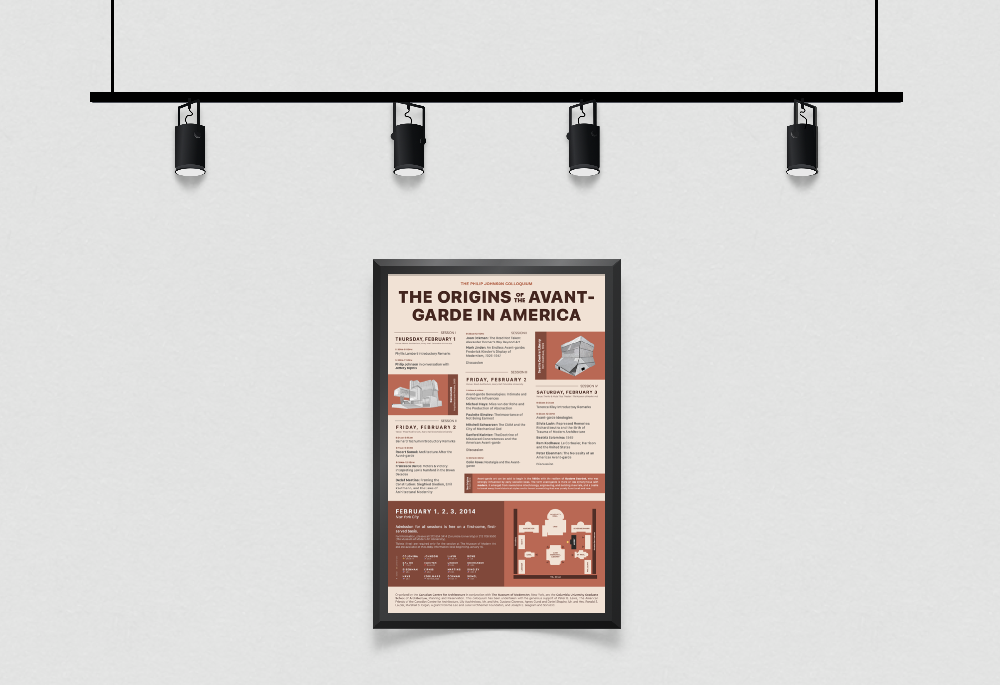

# Museum Poster[^1]
| A poster to encourage the public to learn about unique architecture. |
| --- |

## Table of Contents
1. [Problem](#problem)
2. [Background](#background)
3. [Research](#research)
4. [Approach](#approach)
5. [Design (+ grid)](#design)
6. [Final Result](#final-result)
7. [Insights](#insights)

## Problem
The Canadian Centre for Architecture would like to encourage people to visit their newest exhibit: The Origins of the Avant-Garde in America. The event is free on a first-come, first-serve basis. Ideally, it will inspire novel forms of architecture in the community, provide more support for the Centre, and be accessible to a broad audience.

## Background
The first assignment in my Prototyping course at UC San Diego was to understand how to use underlying grid systems. We were told to create a digital poster with the following requirements:

- Must be a static digital dislay
- Dimensions must be 1024px wide and 1600px tall
- Must use an underlying grid system
- Use at least one image from a folder (modifications allowed)
- Have to use all of the text provided

This initially was a major challenge for the vast amount of text we would _HAVE_ to incorporate:

## Research
Unlike most projects I've worked on, we never get to communicate with the shareholders nor do we know much about our target audience. We were told nothing about who this poster should target. So, I made my own assumptions.

According to the text given, the event was to be held on the following dates and times:

- Thursday, 5:30pm-7:30pm
- Friday, 9:00am-12:15pm, 2:00pm-4:45pm, 5:30pm-6:30pm
- Saturday, 9:00am-12:30pm

The event was primarily held on the week, not weekend, during working hours. That would mean that those working a standard 9 to 5 would miss out on nearly the whole exhibit. For that reason, I made **assumption #1**: this is for retirees.

## Approach
Given that this was going to be a poster for retirees to get them interested in learning about architecture I had 5 things to keep in mind:

### 👀 Bad Eyesight
On the young to old scale, I was going to take a safe assumption that our retirees were leaning towards the latter. That meant I'd be going up against visual impairements and would have to ensure that I had large text, high contrast, and a legible font. Not the simplest task with 3 pages worth of content to fit.

### 🖼️ Integrate Images
I had to incorporate at least 1 image from a folder of architectural marvels. The problem with avant-garde buildings is that they can distract from all the other information. I had to find a way to mesh my poster design with the images.

### ☀️ Warmth
Modern architecture is usually critiqued for being cold and unwelcoming. I wanted the poster to counter this assumption by leaning warm and rich. Also, I wanted to poster to warrant attention but not enough to give our retirees a heart attack.

### 📏 Block It Out
Whenever I have a lot of text, it can feel overwhelming. The best way to comabt this problem is to sub-divide the entire poster into smaller blocks. By grouping content or creating visual divides, the eye can move around and it's easier to take in information.

### ✨ Add Some Spice
- **Location.** This event was located in New York City on a college campus. Even with Google Maps, that would be a challenge to find. So, I needed to add a map or some sort of guide.
- **Diversity.** Did our speakers cover a range of nationalities, races, and genders? If so, I wanted to know.

## Design
### The Photos
The easiest challenge for me to tackle was how to integrate at least 1 photo of a building from the collection we were given. We were allowed to modify or add to the image but we had to include one as an example. I dropped one of the images in Keynote, lowered the opacity to better see the edges and started laying down lines.

**Figures 1-3:** The original photo. The photo with lines outlining it. The render with all the lines making up the architecture of the photo.

### The Layout
I initially started with some VERY rough ideas of layouts. I just wanted to get all my ideas on the table and then I could refine. I didn't enjoy this part of the process because I wanted the text to dictate the spacing I could have rather than forcing the text to fit into the spaces I'd created.

My preferred technique is to throw all the text, images, and map on the screen and move things around until there's a flow or spacing that feels right. I did about 7 black-and-white versions (so color wouldn't distract) until I found one that made more sense.

  
  
  

**Figures 4-6:** Iterations of two vs three columns for the itinerary and position of the map.

The third mock-up felt the best. It broke up content into more meaningful and digestible chunks with the three columns and distinct section. I then began devising a grid for the poster. After planning around more, this is what I came up with.

**The Grid:** Standard sections (title, body, and header) use the same margins. The call-out (map + info) uses a different background color and no margin to feel distinct. The images of avant-garde buildings (two dark rectangles) will also break the grid to be more eye-catching.

### Title
I even tried some more "avant-garde" stylings of the title before settling on a simple, bold design that would be more legible to our audience. The first had part of an image in the letters and the second used buildings to form the letters.

### Colors
I then played around with a number of shades in warm reddish browns, greys, and oranges.

## Final Result
I tried to warm up the poster more, remove some unnecessary color blocks behind the hours, and isolate the details from the map.

## Insights
I learned a number of things from this project both in terms of how to structure a poster but also

- **Audience.** It's really hard to know how to choose colors, styles, layouts, and sizes without really knowing who your audience is. I made quite a few assumptions when doing this so I may have targeted completely different people than the intended audience.
- **More is More?** It's also so challenging trying to find a balance of providing details or information but also keeping the product streamlined and comprehensive. I still go back and forth whether the map is adding value or making the layout weird, if the photos didn't have to be renders, or if I shouldn't have included stats like nationality.
- **Grid-ing.** Using a grid as the basis of all design is super helpful. It allows you to be more creative, bucket information together, divide sections, and direct attention.

[^1]: **Project Details:** Took 1 week to develop. Worked solo. Used Keynote to mock up.