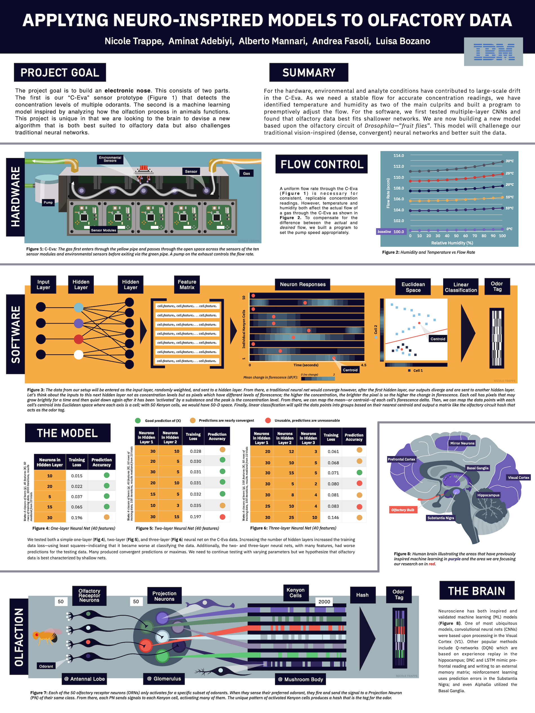

# Electronic Nose Poster
| Graphics to make research a little less complicated. |
| --- |

## Background Blurb
Most electronic-nose projects borrow ideas from gas chromatography or vision-style neural networks. We took a different cue: the **olfactory circuit of _Drosophila_**. Partnering with IBM Research, our team combined **physics** (sensor fabrication & flow control), **chemistry** (odorant panels), **neuroscience** (antenna-to-mushroom-body signal path), and **machine learning** (shallow, sparsely connected networks) to create a two-part platform:
1. **C-Eva sensor array** – 32 MEMS gas sensors housed in a temperature- and humidity-controlled chamber.
2. **Fruit-Fly-Inspired ML model** – a three-layer network whose hidden layer mirrors Kenyon-cell sparsity, offering higher accuracy on noisy olfactory data than conventional CNNs.
The poster walks viewers through the sensor setup to the machine learning model to the inspiration from whence it came. _(Yes I said 'whence')._

## Design
I used Keynote to create the set of sensors, charts, brain, machine learning model, and olfactory circuit of the fruit fly. I wanted each section to feel distinct via a different backgroun (e.g., hardware-blue, machine learning-orange, neuroscience-grey).

## Final Result
