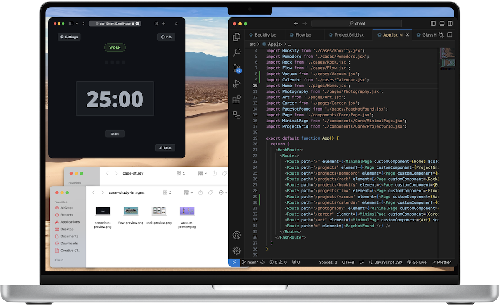

# Pomodoro Timer[^1]
| A web-based timer designed to curb procrastination. |
| -------- |

## Table of Contents
1. Problem
2. Background
3. Research
4. Approach
5. Design
6. Final Result (Demo)
7. Insights

## Problem
Engineering students need to complete giant programming assignments without getting overwhelmed or burnt out. Without a way to break up work into smaller tasks and work for shorter periods of time, engineering students will suffer from a lack of productivity and, potentially, fail to complete assignments.

## Background
At UC San Diego, in my Software Engineering course, we were told to create a pomodoro timer. We had full control over the design and implementation but it had to abide by the Pomodoro Technique[^2]. 

## Research
### Analyze the Competition
If we had been hired to create a timer—rather than assigned it in class—we would want customers to use our product. To do this, we would have to position ourselves uniquely on the market and find ways to prove that our solution was superior. As a team, we investigated the 6 most popular timers.

A number of problems emerged:
- Most timers had a pause/stop button during a “pomodoro” which violated the technique (it should be forfeited).
- All the timers had salient colors, gamification, or notifications—all of which were distracting (another violation).
- Some timers lacked clear signifiers or feedback which reduced usability.

### Try the Technique
While it would be better design practice to source a group of engineering students and conduct a survey or user experience data, we were not afforded the time to do so. Instead, we—engineering students—tried the Pomodoro Technique while completing assignments in our other engineering classes to analyze how the Technique would work for this audience.

## Approach
### Simplicity is Key
As engineers, we'd rather drown in a sea of features than restrain ourselves to work on something as "simple" as a timer (the horror). As a result, this project was a humbling reminder that we design for users and not ourselves. We distilled our initial pile of features down to a handful by asking five questions about each:

- 👩🏻 Who does this benefit?
- 🚘 What is the context?
- ⏰ When would the answer work?
- 🏠 Where would the answer work?
- 🤔 Why is this a problem?

### Sketch it Out
Next, we drew some mockups to visualize how a user might interact with our app. This helped us simplify the controls, improve the layout, and make sure the timer truly was the star of the show.

### User Experience
Beyond simplicity, the most critical component of the app was to guide user behavior. We tested different background colors for levels of salience, how many options to provide, and what could be manipulated or not while working. We wanted to ensure that users would not use the app as a distraction nor be distracted by it.

### Plan for Chaos
We thought about all the ways people might misuse the site, from inputting nonsense to button mashing, and made sure we had test cases covered.

## Design
### Dark Mode Default
Built with engineering students in mind, our app defaults to dark mode for less distraction. Plus, it aligns with the preference of most users for a darker interface.

### Resizing Flexibility
We made the app fully resizable, anticipating users might want to keep it minimized or tucked away in a browser tab. This way, the Pomodoro timer can effectively function as a background process, keeping the main workspace clear.

### Feature Hierarchy
We arranged the UI elements based on their importance. The timer, being the most critical feature, is most prominent. Next, we placed the session labels and timer controls. Settings and other auxiliary features are subtly positioned, maintaining focus on the core functionality.

### User Guidance
To guide user interaction, we implemented visual cues. For example, entering an invalid work session length turns the input field red and defaults to an acceptable value. Additionally, during work sessions, options that could potentially distract, like the **Stats** button or settings to adjust break length, are grayed out and made unclickable.

### Accessibility
We wanted our timer to be universally usable, so we put in the extra effort to ensure screen-reader compatibility and responsiveness to various screen sizes. To enhance usability, we also added keyboard shortcuts.

## Final Result
https://vimeo.com/909267598

**Demo of the App.** See the pomodoro timer in action as we work, take breaks, modify settings, and explore features. For the purposes of the demonstration, we've sped up the timer. If you'd prefer to try it out yourself, find it [here](https://cse110team33.netlify.app/).

 

 Transcript

When we first open the app, we see a dark screen with 6 features. From left to right, we have a button for settings, a label indicating a work session, a timer with 25 minutes, a button to start the timer, a button for information, and a button for statistics.

When we click **Start**, the timer immediately starts to tick down from 25 minutes. The button that previously said **Start** has now changed to **Restart**. Note that we did speed up this timer for the demo.

At 23 minutes or so, we click **Restart** to stop the timer and set it back to 25 minutes. This is considered an interruption and we have forfeited this pomodoro.

We then open up settings, navigate to the time section and adjust the length of a work session from 25 to 2. The timer now shows 2 minutes.

We click **Start** and the timer begins to tick down from 2 minutes. While the timer is running, we click the settings button to open the sidebar and see that all options, except volume, are greyed out and cannot be clicked. No distractions are allowed.

When the timer runs out, the label for work turns to short break and we have five minutes on the timer. There are 4 squares below this label that previously were greyed out. One of these squares is now a bright green indicating one successful pomo--or work session.

We open settings again, this time to adjust the length of a short break to 1 minute. Note that settings does not allow you to input less than 1 minute or more than 60 minutes because it would go against the pomodoro technique.

We click Start and let the short break timer run down. Once complete, we click statistics to open up a display of four blocks. From left to right, the first block represents work sessions, then short breaks, then long breaks, and, finally, interruptions. Here, we see 1 square block indicating a work session, 1 square block for a short break, and 1 red square for an interruption.

We open up setting again and navigate to the display section. Here, we click the toggle button to turn off dark mode. Now, the screen is white and the timer numbers are black. We start the timer to complete our second pomo--or work session.

When the timer runs out, we have successfully finished that pomo and we should go into our second short break. We now have 2 green squares on the screen representing our work sessions.

We open settings again and navigate to the display section. This time we click the toggle for calm mode, turning it on. Instead of showing minutes and seconds on the timer, the calm mode shows only minutes. This is supposed to reduce further distractions by displaying fewer changes.

With '2m' representing 2 minutes on the timer, we click **Start** and and complete our second break. The video ends after this.

## Insights
- **Simplicity is Hard!** You can't hide behind your features so you have to completely understand your user, prioritize the features they need, and perfect it.
- **Usage Before Construction.** Understand when, how, and when your users will be using your tech before you start designing your architecture. Even knowing that the app would be minimizing the forced into different dimensions informed us early on that we needed a component architecture and lots of flex box.
- **It's Never Finished.** Looking back on this app years later, I see so many more improvements we could make now that I've had much more experience in web development and fresh eyes. It's a good reminder that your projects are never completely done, there's always opportunities for improvement.

[^1]: **Project Details:** Took 2 months to develop. Worked in a team of 11 as the lead designer and architect. Used JavaScript, Cypress, and Netlify.
[^2]: **The Pomodoro Technique:** (A) Work for a “pomodoro” (typically 25 minutes). (B) Take a 5 minute break after the "pomodoro". (C) After 3 “pomodoros", take a longer 15 minute break. (D) If a “pomodoro” is interrupted, it is forfeited and must be restarted.