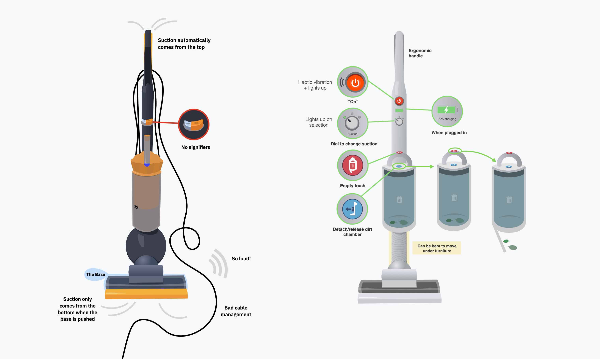

# Tesla Vacuum[^1]
| A lightweight, powerful, and portable vacuum. |
| -------- |

## Table of Contents
1. [Problem](#problem)
2. [Background](#background)
3. [Research](#research)
4. [Approach](#approach)
5. [Design](#design)
6. [Final Result](#final-result)
7. [Insights](#insights)

## Background
In DSGN 1—grounded in _The Design of Everyday Things_—we set out to redesign a common student tool or appliance. Through an initial mind‑mapping exercise, we identified everyday objects that every college student encountered, from water bottles and iClickers to car fobs. Vacuums emerged as a clear candidate: nearly every dorm room needed one, yet conventional models were heavy, noisy, and awkward to operate. Our goal was to apply core principles of affordances, signifiers, feedback, and discoverability to redesign a student vacuum.

## Problem
How might we design a cordless vacuum for students that feels lightweight, is easy to empty, and stays quiet enough to use in shared spaces?

## Research
### Quantitative Evaluation
We sourced 15 different vacuums—ranging from bulky upright models to lightweight sticks—and scored each on:

- **Suction vs. Noise:** Measured peak suction power alongside decibel readings at one meter.
- **Durability vs. Portability:** Assessed build materials and failure reports against weight and form factor.

Plotting these axes revealed clear trade‑offs: high‑suction models were too loud for shared suites, while the quietest were flimsy and difficult to maneuver.

**Figure 1:** Suction (↑) vs. Noise (↓) across a subset of vacuums. Vacuums with powerful suction often were noisy.

**Figure 2:** Durability (↑) vs. Portability (↑) across a subset. Vacuums with high portability often had low durability.

### Contextual Inquiry
Next, we invited the 15 vacuum owners to demonstrate their devices in situ. As they navigated carpet-to‑tile transitions, untangled cords, and emptied dustbins, we:

1. 🔬 Observed use patterns—particularly cable snags around furniture legs and corners.
2. ⏱️ Timed routine tasks to gauge efficiency bottlenecks.
3. 📋 Interviewed each participant about likes, dislikes, and workarounds.

Our affinity mapping distilled three dominant pain points:
- **Trip Hazards & Cord Management:** Users repeatedly tripped or stopped to rewind cables.
- **Complex Emptying Process:** Buttons were hard to find; reseating bins required extra force and guesswork.
- **Non‑Intuitive Controls:** Power and suction adjustments lacked obvious signifiers, leading to fumbling and wasted time.

## Approach
### Defining the "Worst" Baseline
By overlaying our quantitative plots with the qualitative themes, we pinpointed the single underperforming model that combined excessive noise, poor portability, and confusing emptying. This “worst” vacuum became our redesign canvas, maximizing the opportunity to demonstrate improved user experience.

### Ideation & Feature Prioritization
Focused on the top pain points, we sketched dozens of concepts before converging on four pillars:

1. **Portability & Affordances**
- An articulating swivel joint—modeled on bus‑accordion connectors—lets the wand bend under low furniture.
- A pistol‑grip handle with a molded cradle makes it unmistakable where to hold.
2. **Quiet, Powerful Suction**
- Inspired by Tesla’s silent electric motors, we specified a brushless digital motor with acoustic insulation.
- A graded suction dial—complete with detents and an LED ring—lets users feel and see each setting.
3. **Clear Signifiers & Controls**
- **Power Button:** Red, with the classic ⏻ icon and haptic click.
- **Empty Button:** Magenta, embossed with a disposal icon.
- **Release Button:** Blue, marked with a chamber‑detach graphic.
4. **Rich Feedback Loops**
- Haptic pulses when powering on/off.
- Tactile “snap” when the dustbin locks.
- Charging LEDs on the handle: green (>20%), yellow (10–20%), red (<10%).

## Design

[^1]: **Project Details:** Took 3 weeks to develop. Worked in a team of 4. Mocked up designs in Keynote.