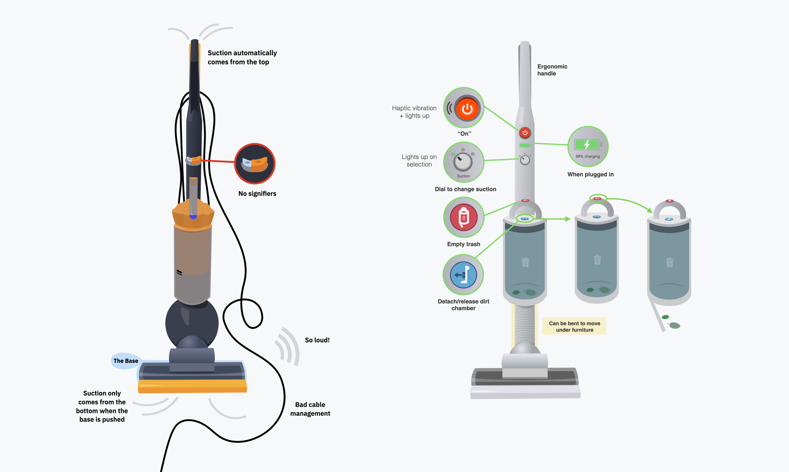

# Tesla Vacuum[^1]
| A lightweight, powerful, and portable vacuum. |
| --- |

## Table of Contents
1. [Problem](#problem)
2. [Background](#background)
3. [Research](#research)
4. [Approach](#approach)
5. [Final Result](#final-result)
6. [Design](#design)
7. [Insights](#insights)

## Problem
How might we design a cordless vacuum for students that feels lightweight, is easy to empty, and stays quiet enough to use in shared spaces?

## Background
In DSGN 1—grounded in _The Design of Everyday Things_—we set out to redesign a common student tool or appliance. Through an initial mind‑mapping exercise, we identified everyday objects that every college student encountered, from water bottles and iClickers to car fobs. Vacuums emerged as a clear candidate: nearly every dorm room needed one, yet conventional models were heavy, noisy, and awkward to operate. Our goal was to apply core principles of affordances, signifiers, feedback, and discoverability to redesign a student vacuum.

## Research
### Quantitative Evaluation
We sourced 15 different vacuums—ranging from bulky upright models to lightweight sticks—and scored each on:

- **Suction vs. Noise:** Measured peak suction power alongside decibel readings at one meter.
- **Durability vs. Portability:** Assessed build materials and failure reports against weight and form factor.

Plotting these axes revealed clear trade‑offs: high‑suction models were too loud for shared suites, while the quietest were flimsy and difficult to maneuver.

**Figure 1:** _Suction (↑) vs. Noise (↓) across a subset of vacuums. Vacuums with powerful suction often were noisy_.

**Figure 2:** _Durability (↑) vs. Portability (↑) across a subset. Vacuums with high portability often had low durability._

### Contextual Inquiry
Next, we invited the 15 vacuum owners to demonstrate their devices in situ. As they navigated carpet-to‑tile transitions, untangled cords, and emptied dustbins, we:

1. 🔬 Observed use patterns—particularly cable snags around furniture legs and corners.
2. ⏱️ Timed routine tasks to gauge efficiency bottlenecks.
3. 📋 Interviewed each participant about likes, dislikes, and workarounds.

Our affinity mapping distilled three dominant pain points:
- **Trip Hazards & Cord Management:** Users repeatedly tripped or stopped to rewind cables.
- **Complex Emptying Process:** Buttons were hard to find; reseating bins required extra force and guesswork.
- **Non‑Intuitive Controls:** Power and suction adjustments lacked obvious signifiers, leading to fumbling and wasted time.

## Approach
### Defining the Worst-Case Baseline
Overlaying quantitative and qualitative data picked a single _triple-loser_ (noisy, heavy, confusing). Redesigning that model promised the biggest UX lift. 

#### Four Pillars for the Redesign
1. **Portability** – bus‑accordion connectors + ergonomic grip
2. **Quiet Power** – "tesla"-style electric motor + acoustic baffles
3. **Intuitive Controls** – color-coded buttons, tactile dial, + obvious icons
4. **Rich Feedback** – haptics for on/off, LEDs, audible snaps

## Final Result
_Ta-da_ our redesigned vacuum.

## Design
In our redesign, every element was driven by Norman’s key principles: **affordances**, **signifiers**, **feedback**, **mapping**, and **discoverability**. Here’s how each principle shaped the “Tesla Vacuum.”

| Principle | Definition | Evidence in the Redesign |
| --------- | ---------- | ------------------------ |
| Perceptual affordance | Physical form suggests how it's used | - Pistol-grip handle molds to the palm   - Accordion joint invites bending under couches |
| Perceptual-motor skill support | Large, low-precision target for quick action | - Big power button fits thumb   - Dial aligned to fingers |
| Feedforward | Shows consequence before action | - Light on prospective suction level as soon as dial is moved |
| Feedback | Immediate response to user action | - Haptic pulse on power to confirm action   - LED lights up on suction level + level click felt for dial   - Audible "snap" on dirt chamber lock   - When plugged in, LED shows level |
| Semantic Carrier of Meaning | Abstract symbol communicates via learned code | - Classic power button icon   - Charging level: green → yellow → red |
| Direct Carrier of Meaning | Icon depicts literal action | - "Empty" button with icon of bottom of bin opening   - "Release" button with chamber removed from vacuum graphic |
| Coupling | Control is spatially/temporarlly linked to effect | - "Release" button on handle where you would pick it up |
| State Visibility | Current mode always knowable | - Translucent bin shows fill level |
| Uniformity | Similar things look/act alike | - All actionable buttons are circular | 
| Gestalt - Common Region | Items inside border are grouped | - Suction dial, power button, and charging state sit together near handle |
| Gestalt – Prägnanz | Prefer simplest stable form | - Minimal icon set   - Monochrome body with color for interactive elements _only_ |
| Mapping | Relationship between controls + effects | - Turning the dial clockwise increases suction in predictable, linear increments |

### Detailed Walk-through
#### Buttons & Controls
- **Red Power Button**
  - High‑contrast red and the universal “power” symbol make startup/shutdown immediately obvious.
- **Magenta “Empty” Button**
  - A salient color indicating a major action will occur and a symbol with the bottom of the bin open signal “this is how you release debris.”
- **Blue “Release” Button**
  - Distinct hue and a dirt-chamber removed graphic clearly differentiate “remove chamber” from “empty chamber.”
- **LED Ring Around Suction Dial**
  - Illuminated segments correspond to each suction level, inviting users to twist the dial.

**Figure 4:** _Iterating over the "empty" and "release" buttons._

#### Discoverability
- **Controls** are directly under the natural hand position.
- **Translucent** dirt chamber/bin shows dirt accretion.

**Figure 5:** _Due to the chamber's transparency, it is clear that debris has built up._

## Insights
- **Axis Trade-Offs.** Given that we could only model 2 charts, each with 2 axis, we were forced to hone in on the most impactful pain points. This was a challenge (as designers we want to make _everything_ better!) but it was incredibly helpful to focus our energy.
- **Obvious buttons.** Designing buttons was _hard_. It was easy enough to use common conventions around color (e.g., red for salient) and universal symbols (e.g., power button). But, it was incredibly hard trying to develop icons that screamed "empty the chamber!" or "release the chamber".
- **Sensory Feedback.** Adding haptic pulses, detent clicks, and audible “snaps” transformed the vacuum from a guessing game into an intuitive tool. When users feel and hear each action’s success, they spend less time wondering “did that work?”.

[^1]: **Project Details:** Took 3 weeks to develop. Worked in a team of 4. Mocked up designs in Keynote.